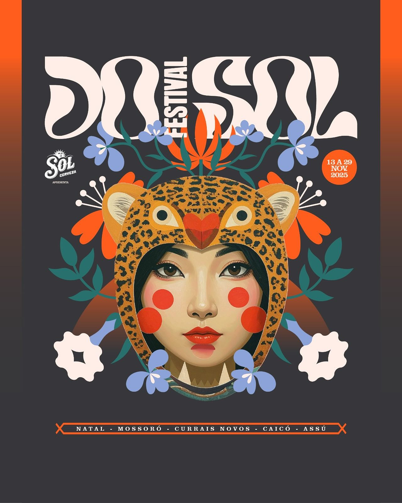
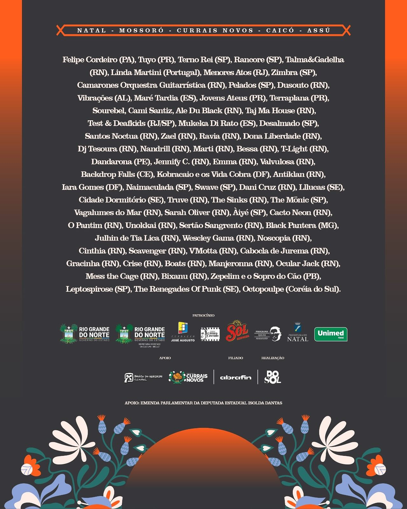

+++
date = '2025-10-14T16:44:23-03:00'
draft = false
title = 'Deafkids + Test no Festival DoSol 2025'
categories = 'shows'
+++

**Test + Deafkids** tocam as músicas do disco "Sem Esperanças", dia 29 de novembro, no **Galpão 292**, em Natal/RN, parte da programação da 22ª edição do Festival DoSol.

<!--more-->

**GALPÃO 292**

- 17h40 - Test & Deaf kids (RJ/SP)
- 19h - Zepelim e o Sopro do Cão (PB)
- 20h30 - Desalmado (SP)
- 22h10 - The Renegades Of Punk (SE)
- 00h - Mukeka Di Rato (ES)
- 01h20 - Leptospirose (SP)





---

### Escute o álbum:

  

    <iframe
      src="https://bandcamp.com/EmbeddedPlayer/album=1880855551/size=large/bgcol=ffffff/linkcol=333333/artwork=small/transparent=true/"
      style="
        top: 0;
        left: 0;
        width: 100%;
        height: 100%;
        position: absolute;
        border: 0;
      "
      allowfullscreen
    ></iframe>
  

