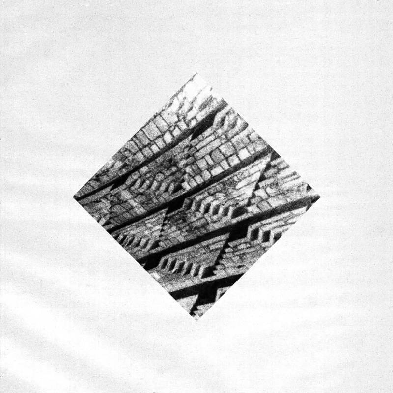
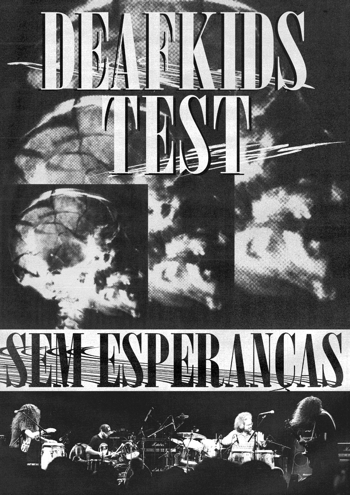
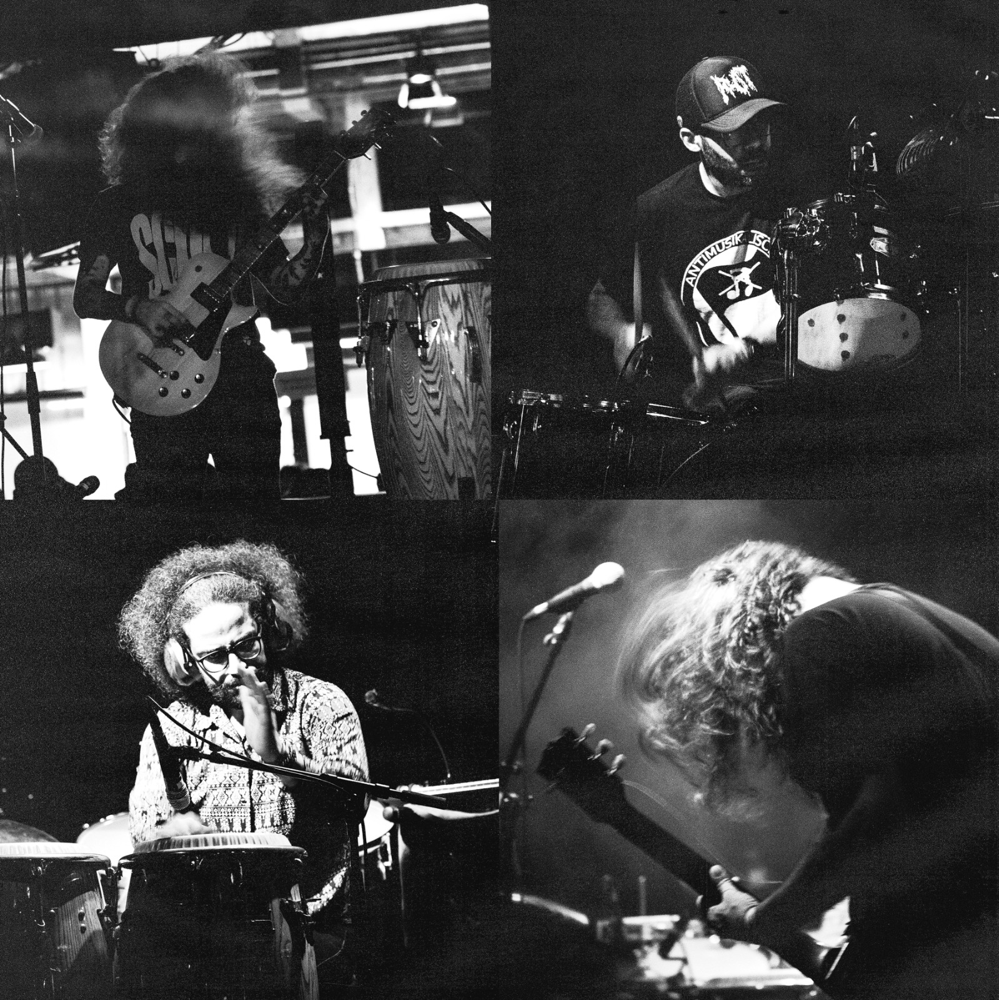

+++
date = '2025-09-10T19:10:00-03:00'
draft = false
title = 'Out Now! Test + Deafkids: "Sem Esperanças"'
categories = 'Releases'
+++

Our collab record with Deafkids is available now!

<!--more-->

Celebrating 15 years of career, **DEAFKIDS** and **TEST** performed together on the legendary stage of SESC Pompeia in São Paulo on January 10th, 2025, in a historic sold-out night. The joint show put to the test why both bands are regarded as icons of extreme, experimental and avant-garde independent music – not only in Brazil, but worldwide. This partnership finally resulted in an studio collaborative album recorded at the end of 2024, the culmination of years of collaboration between the two groups.

In December 2024, **TEST** and **DEAFKIDS** gathered in the studio for three days to create and document the entire process. With two drum kits, two guitars, effects, synthesizers, vocals and percussion, they produced 10 brand new tracks showcasing the full creativity and experimental spirit of both bands. From drone-laden slow, menacing dirges, to all-out avant-grind assaults, ambient atmospheres and percussive, frenzied grooves, the album broadcasts many years of experimentation, and the merger of both bands' unique and inimitable approach to sonic research.

The album, entitled "**Sem Esperanças**" (No Hope), it's available on digital platforms It will also come out in physical formats on vinyl through [Rapid Eye Records](https://rapideyerecords.bandcamp.com/) (Europe, shipping by the end of october) and [All Music Matters](https://www.instagram.com/ammrecs/) (Brazil), and on CD by [Cospe Fogo](https://www.cospefogo.com/) (Brazil).

  

    <iframe
      src="https://bandcamp.com/EmbeddedPlayer/album=1880855551/size=large/bgcol=ffffff/linkcol=333333/artwork=small/transparent=true/"
      style="
        top: 0;
        left: 0;
        width: 100%;
        height: 100%;
        position: absolute;
        border: 0;
      "
      allowfullscreen
    ></iframe>
  

### Test + Deafkids:

- **João Kombi:** Guitar, vocals
- **Barata:** Drums
- **Douglas Leal:** Guitar, vocals,
  synths, percussion, tenor sax, berimbau
- **Marian Sarine:** drums, percussion

Recording, mixing and mastering by:
[André Leal](https://www.instagram.com/andreleal_) e [João Kombi](https://www.instagram.com/test_death).

Mixing and mastering by:
[André Leal](https://www.instagram.com/andreleal_) e [Kleber Mariano](https://www.instagram.com/klebermariano) no [estudiojukebox](https://www.instagram.com/andreleal_).

Artwork and Design by
[Douglas Leal](https://www.instagram.com/agua___escura/)

Photos by
[Régis Bezerra ](https://www.instagram.com/regisbzrra/)




