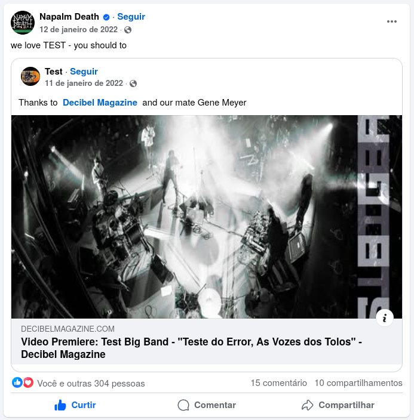

+++
date = '2010-09-01T19:10:00-03:00'
draft = false
title = 'Release'
featured = 'test-japão-rafael-yekashi.jpg'
menu = 'main'
+++

TEST é um duo brasileiro formado em 2010 por João Kombi (guitarra e voz) e Barata (bateria), dois veteranos da cena underground de São Paulo. Conhecida por sua intensa atividade ao vivo, colaborações marcantes com nomes como Iggor Cavalera e Deafkids, e uma abordagem musical destemida, a banda se consolidou como um dos nomes mais inventivos da cena alternativa nacional.

<!--more-->

A trajetória do TEST começou nas ruas: em 2011, a dupla passou a se apresentar em frente a grandes eventos em casas de shows e estádios, com um gerador instalado em uma Kombi. A iniciativa ousada chamou atenção – e deu certo. Desde então, já foram mais de mil apresentações em 28 países, com turnês na América do Norte, Europa e Ásia, além de incontáveis shows por TODOS os estados do Brasil.

Hoje, o TEST acumula no currículo apresentações com gigantes da música – desta vez oficialmente no palco – como King Diamond, Napalm Death, Carcass, Cannibal Corpse, Exodus, Brujeria, Mayhem, Mortician e The Dillinger Escape Plan. A banda conquistou fãs de peso ao longo do caminho: Shane Embury (Napalm Death) e os irmãos Max e Iggor Cavalera são alguns dos que declararam publicamente sua admiração pelo grupo. Iggor, inclusive, já citou Barata como um dos nove melhores bateristas de todos os tempos.

Transitando entre universos musicais, o TEST também já se apresentou ao lado de artistas como Tom Zé, Boogarins e Metá Metá, rompendo barreiras entre estilos distintos. No currículo, estão participações em alguns dos maiores festivais de música extrema do mundo – como o Obscene Extreme (República Tcheca) e o Maryland Deathfest (EUA) – além de presença constante nos principais festivais e palcos da cena independente brasileira, como Abril Pro Rock, Coquetel Molotov, Novas Frequências, Circo Voador, Espaço das Américas e Virada Cultural de São Paulo (com palco próprio).

 

Com um ritmo incansável de gravações e apresentações, o TEST celebra 15 anos de estrada com uma discografia robusta: são 19 lançamentos entre álbuns, EPs e splits, gravados em parceria com bandas de diversos cantos do mundo, incluindo Chepang (Nepal), Cloud Rat e Ixias (EUA), e Struggle Session (China).

Ao longo dessa trajetória, a dupla soma dois longas-metragens e mais de 10 mil discos físicos vendidos – fruto de um modus operandi auto-sustentável, que cria novas maneiras de autogestão. TEST é uma banda sem pares.

### Alguns festivais que o Test tocou:

- 71'O Grind: Colorado Springs, Estados Unidos (2016, 2018)
- Abril Pro Rock: Recife, Brasil (2012)
- Avant Art Festval: Wroclaw, Warsaw and Lublin na Polônia (2024)
- Dreary North Fest: Chicago, Estados Unidos (2023)
- Earslaughter Festival: Montreal, Canadá (2018)
- Extreme Sounds of Latin America: Berlin, Alemanha
- Festival DoSol: Natal, Brasil (2012, 2023, 2025)
- Festival Eletronika: Belo Horizonte, Brasil (2011)
- FIME (International Festival of Experimental Music): São Paulo, Brasil (2016)
- Full Terror Assault: Cave In Rock, Illinois, Estados Unidos (2022)
- Gekiko Fest: Tóquio, Japão (2025)
- In-Edit: São Paulo, Brasil (2022)
- Loches en Grind: Loches França (2012)
- Maryland DeathFest: Maryland, Estados Unidos (2016, 2018)
- Milhões de Festa: Barcelos, Portugal (2015)
- Morrostock: Sapiranga, Rio Grande do Sul, Brasil (2014)
- No Ar Coquetel Molotov: Recife, Brasil (2020, 2022)
- Novas Frequencias: Rio de Janeiro, Brasil (2020, 2023, 2025)
- Obscene Extreme America: Ciudad Del Mexico, México (2013)
- Obscene Extreme Festival: Trutnov, Rerpública Tcheca (2015)
- Porão do Rock: Brasília, Brasil (2013)
- SWR Barroselas Metal Fest: Barroselas, Portugal (2017, 2025)
- Virada Cultural São Paulo: São Paulo, Brasil (2013, 2014, 2015, 2016 e 2017)
- Zoro Fest: Leipzig, Alemanha (2012)

### Turnês fora do Brasil:

**(com Escuela Grind, Deterioration, Chepang, Ixias, Bandit and muitas outras)**

- Argentina: 2016, 2019
- Ásia: 2025
- Colômbia: 2017, 2023
- Europa: 2011, 2012, 2015, 2017, 2024, 2025
- México: 2013
- Paraguai: 2023, 2019
- Estados Unidos: 2014, 2015, 2016, 2018, 2022

### Como banda de abertura:

- Agathocles
- Backslider
- Boogarins
- Brujeria
- Cannibal Corpse
- Carcass
- Cavalera Conspiracy
- Death DTA
- Dillinger Escape Plan
- Exodus
- Full of Hell
- Juçara Marçal
- King Diamond
- Krisiun
- Lightning Bolt
- Mayhem
- Metá Metá
- Mortician
- Napalm Death
- Obituary
- P.L.F.
- Phobia
- Ratos de Porão
- Sepultura
- Soulfly
- Tom Zé
- Wormrot

  <iframe
    width="560"
    height="315"
    src="https://www.youtube.com/embed/LODWRJGc1I8"
    frameborder="0"
    allow="accelerometer; autoplay; encrypted-media; gyroscope; picture-in-picture"
    allowfullscreen
  ></iframe>

