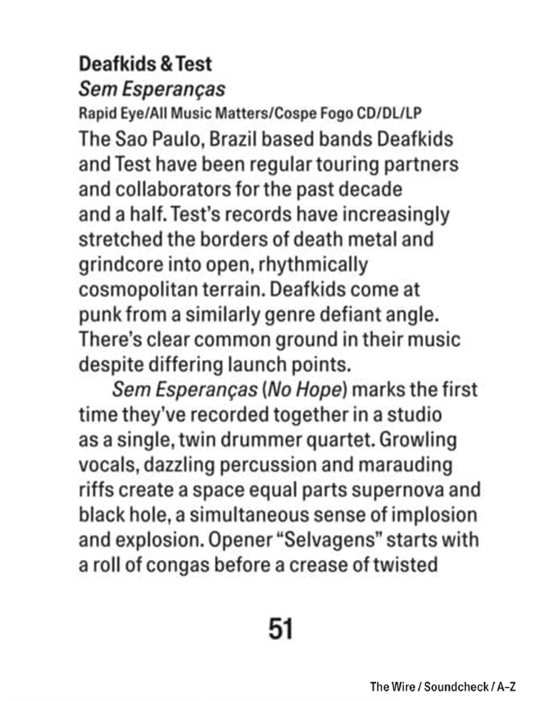
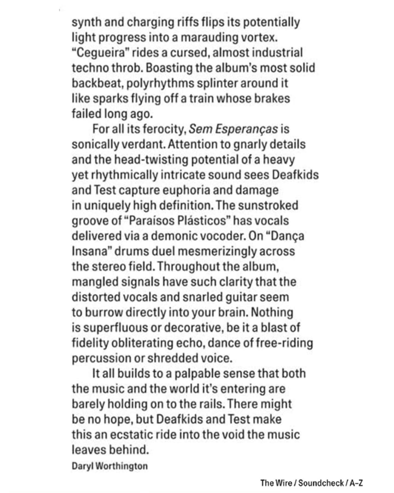

+++
date = '2025-09-10T10:52:46-03:00'
draft = true
title = 'Sem Esperanças'
showHero = 'article.showHero'
+++

Celebrando 15 anos de carreira, **DEAFKIDS** e **TEST** se apresentaram juntos no lendário palco do SESC Pompeia, em São Paulo, no dia 10 de janeiro de 2025, em uma noite histórica com ingressos esgotados. O show conjunto colocou à prova o motivo pelo qual ambas as bandas são consideradas ícones da música independente extrema, experimental e vanguardista – não apenas no Brasil, mas em todo o mundo.

Essa parceria resultou, finalmente, em um álbum colaborativo de estúdio, gravado no final de 2024, culminando anos de colaboração entre os dois grupos.

Em dezembro de 2024, **TEST** e **DEAFKIDS** se reuniram em estúdio por três dias para criar e documentar todo o processo. Com duas baterias, duas guitarras, efeitos, sintetizadores, vocais e percussões, eles produziram 10 faixas inéditas que demonstram toda a criatividade e o espírito experimental das duas bandas. De faixas arrastadas e ameaçadoras carregadas de drone, a ataques de avant-grind, atmosferas ambient e grooves percussivos frenéticos, o álbum transmite anos de experimentação e a fusão dos estilos únicos e inimitáveis de pesquisa sonora de ambas as bandas.

O álbum, intitulado "**Sem Esperanças**", está disponível nas plataformas digitais. Também será lançado em formato físico em vinil pela [Rapid Eye Records](https://rapideyerecords.bandcamp.com/) (Europa) e [All Music Matters](https://anomaliadistro.com.br/) (Brasil), e em CD pela [Cospe Fogo](https://cospefogo.bandcamp.com/) (Brasil)

# Resenhas

## Wire Magazine





## Cvlt Nation




