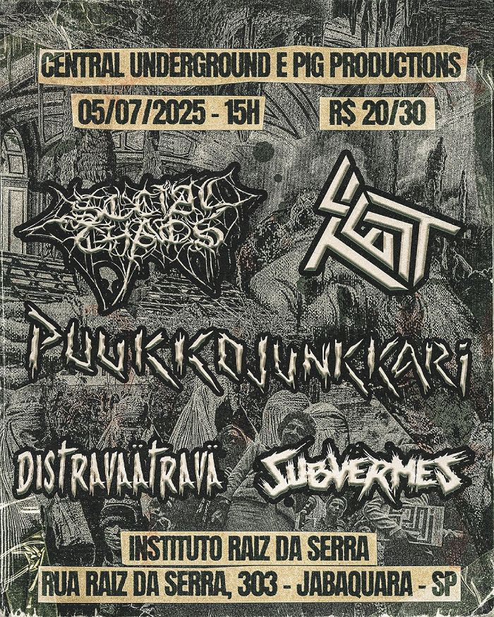

+++
date = '2025-06-26T19:10:00-03:00'
draft = false
title = 'Test no Jabaquara, em São Paulo'
categories = 'shows'
+++

**Test**, **Social Chaos**, **Puukkojunkkari**, **Distravaätravä** e **Subvermes**, dia 5 de julho no Instituto Raiz da Serra, no Jabaquara, zona sul de São Paulo.

<!--more-->

Os organizadores pedem que, se possível, levem doações para o espaço (alimentos não perecíveis, material de higiene/limpeza, utensílios domésticos, etc). Como muitos já sabem, o Instituto Raiz da Serra é uma ocupação cultural, e depende de doações para que as atividades possam seguir e para que possamos realizar uma mínima manutenção do espaço.

