+++
date = '2025-10-27'
draft = false
title = 'Sem esperanças'
showHero = 'article.showHero'
+++

Completando 15 anos de carreira, **DEAFKIDS** e **TEST** se apresentaram no palco do SESC Pompeia em São Paulo no dia 10 de janeiro de 2025 em uma noite histórica de ingressos esgotados e um show conjunto que colocou à prova porquê são citados como ícones da música independente extrema, experimental e de vanguarda - não só no Brasil - mas em todo o mundo. Essa parceria finalmente resultou em um álbum gravado no final de 2024, fruto de anos de colaborações entre as bandas.

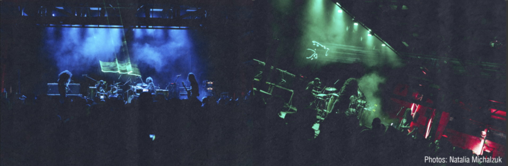

O álbum, intitulado "Sem Esperanças", lançado em 5 de setembro de 2025 nas plataformas digitais, também será lançado em formato físico em vinil pela Rapid Eye Records (Europa) e All Music Matters (Brasil), e em CD pela Cospe Fogo (Brasil).

Em dezembro de 2024, TEST e DEAFKIDS se reuniram em estúdio por três dias para criar e documentar todo o processo. Com duas baterias, duas guitarras, efeitos, sintetizadores e percussões, eles produziram 10 faixas inéditas que demonstram toda a criatividade e o espírito experimental de ambas as bandas. De canções fúnebres lentas e ameaçadoras carregadas de drones a ataques avant-grind atmosféricos e groves percussivos e fenéticos, o álbum transmite muitos anos de experimentação e a fusão da abordagem e pesquisas sônicas únicas e inimitáveis de ambas as bandas.


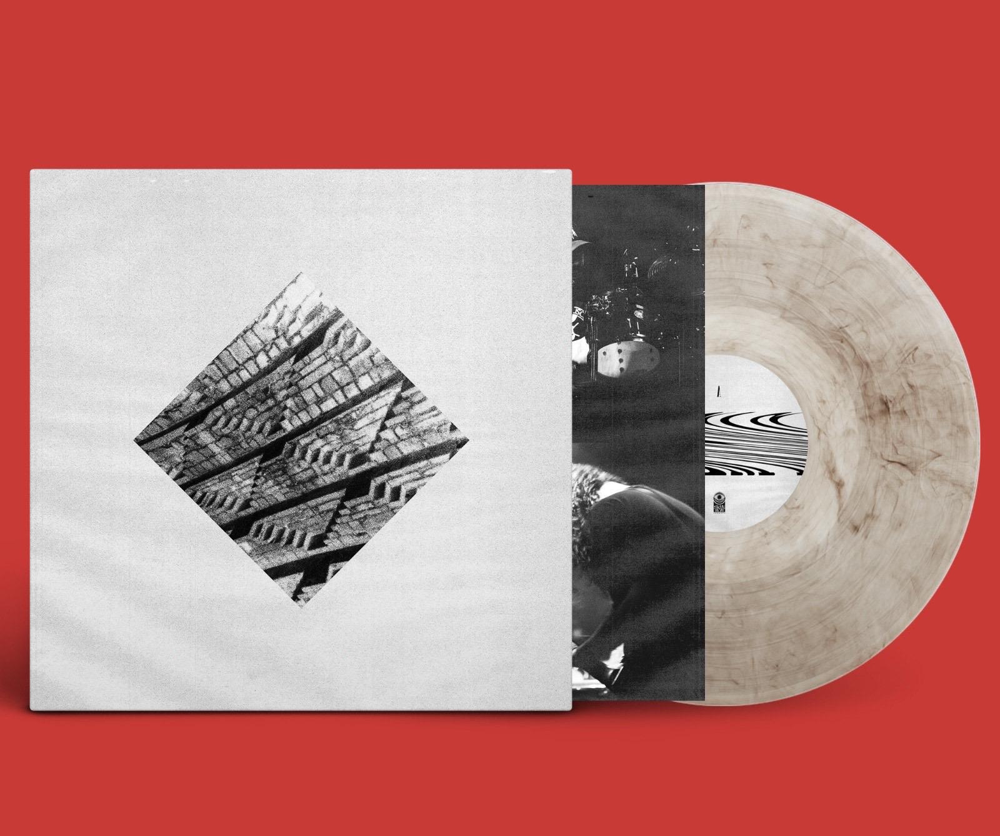
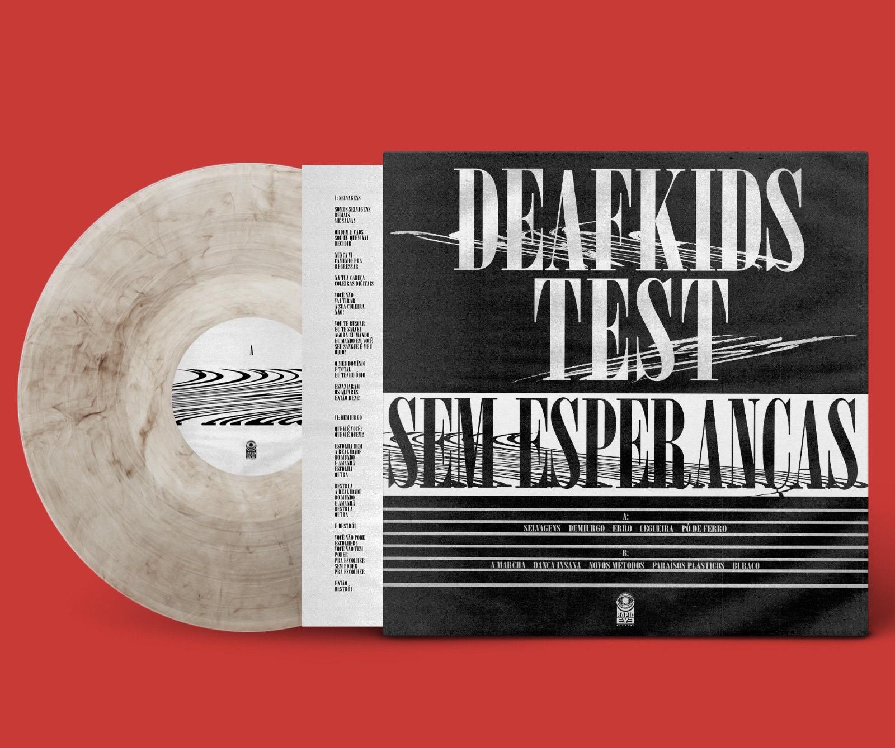
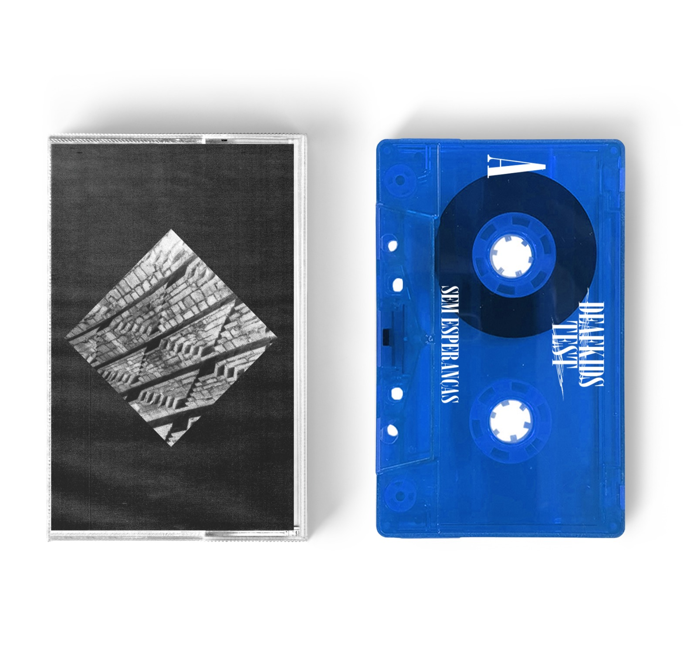
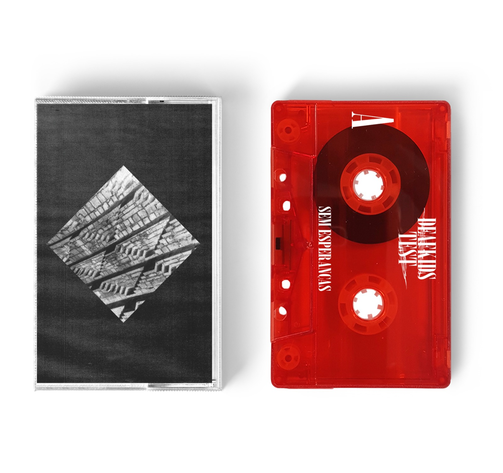

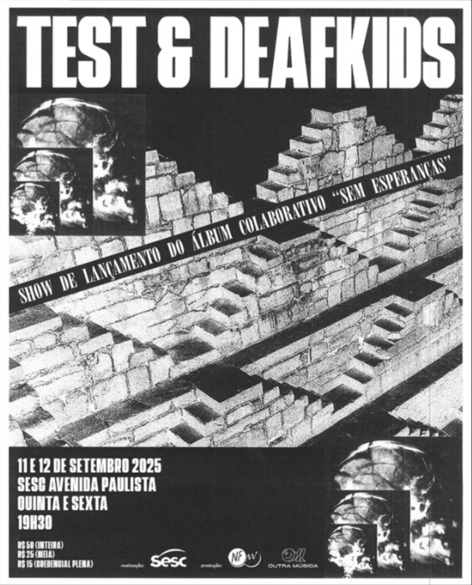



O projeto “NO HOPE TOUR” surgiu em 2018 com a ideia de viajar ao máximo de cidades possíveis a bordo de uma Kombi para uma série de shows em conjunto, e até o momento já percorreu 66 cidades em 16 países. Sua primeira edição que contou com o apoio da cerveja Red Stripe e da revista VICE resultou na primeira apresentação como DEAFTEST em um show esgotado no recém-inaugurado SESC Avenida Paulista. Em 2024, a terceira edição percorreu o Sudeste e Sul do Brasil, além de duas datas com a banda norte-americana Lightning Bolt e a participação do Festival Música Quente com Juçara Marçal. O impacto gerou um convite para 3 concertos no conceituado festival polonês Avant Art, uma turnê européia de 16 shows em 12 países e uma extensão para a Ásia, com um show em Istambul.


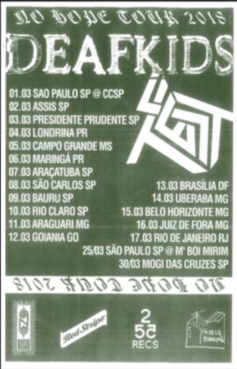
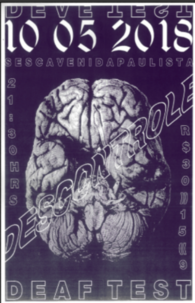
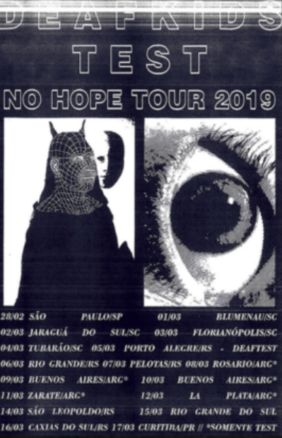
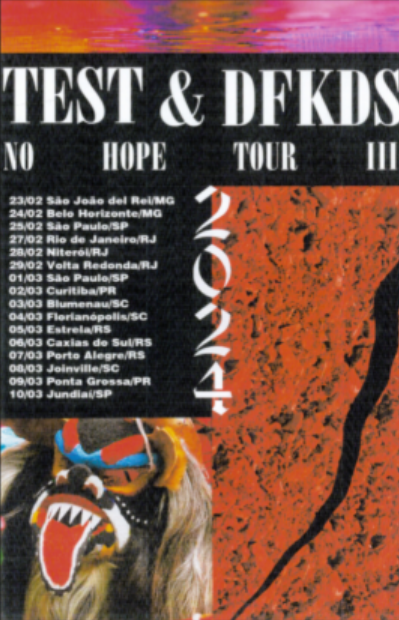
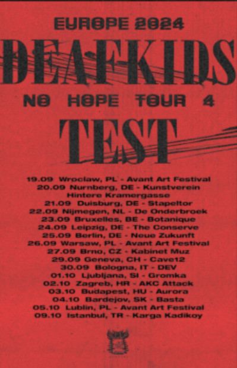
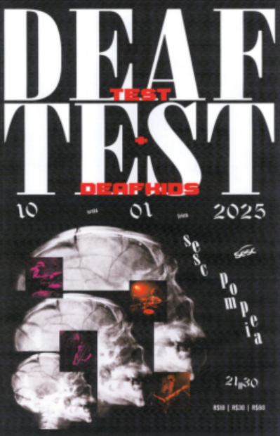
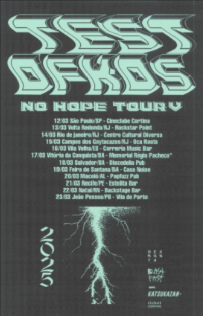
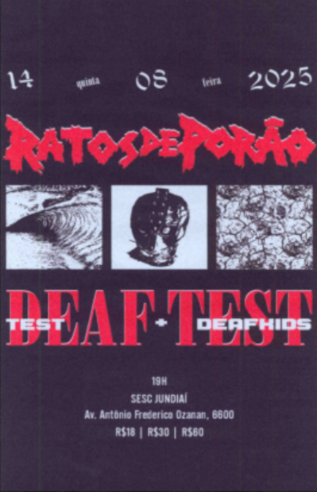


TEST e DEAFKIDS já realizaram mais de 100 shows juntos, incluindo apresentações no SESC Pompeia, SESC Avenida Paulista, SESC Belenzinho, CCSP e Virada Cultural. Em 2025 as bandas realizaram a quinta edição da “NO HOPE TOUR” que aconteceu em março, levando a turnê conjunta pela primeira vez ao Nordeste do Brasil.

TEST ultrapassou recentemente a marca de 1.000 shows realizados em 28 países. Em uma turnê extensa de 50 apresentações, passou por Europa, Japão, Coreia do Sul, Singapura e Tailândia, consolidando sua trajetória como uma das bandas mais ativas e itinerantes da cena extrema. Só em 2024, o duo realizou mais de 90 shows, incluindo a participação no Festival Radical Sounds Latin America, em Berlim, ao lado de Iggor Cavalera. Agora, prepara-se para lançar três álbuns colaborativos com DEAFKIDS, Papangu e Goatburner, com lançamentos previstos para 2025 e 2026. Ao longo da carreira, TEST já dividiu os palcos com nomes como King Diamond, Napalm Death, Tom Žé, Dillinger Escape Plan, Brujeria, Metá Meta, Sepultura, Carcass, Soufly, etc.

DEAFKIDS vem se firmando há alguns anos como um dos principais nomes de música extrema/experimental brasileira no exterior. Assinados pela gravadora norte-americana Neurot Recordings desde 2016 e com diversos lançamentos aclamados pela crítica internacional, já somam várias participações em festivais renomados como Roadburn (Holanda) Supersonic (UK), Amplifest (PT), Donau (AT), A Colossal Weekend (DK), Novas Frequências (BR), etc. além de turnês pelo Brasil, Europa e América do Norte com nomes consagrados - como Neurosis (EUA), Oransi Pazuzu (FI), Rakta (BR), Big Brave (CA) - participação na trilha do game Cyberpunk 2077 e diversas publicações (The Guardian, The Wire, Folha de S. Paulo, Atropunk, CVLT Nation, Revolver Magazine, etc), além de trabalhos em colaboração com nomes como Jaz Coleman (Killing Joke), Petbrick (projeto de Iggor Cavalera), e Duma (Nyege Nyege Tapes). DEAFKIDS já dividiu os palcos com nomes como Neurosis, Eyehategod, Converge, Godflesh, Melt Banana, As Mercenárias, Lightning Bolt, The Varukers, Juçara Marçal, etc.

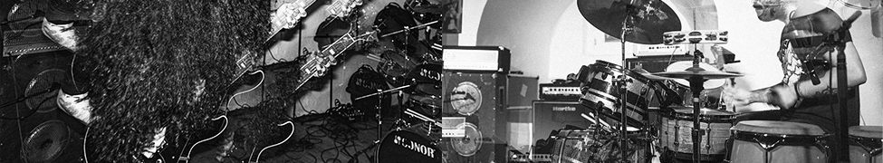

O que esperar musicalmente dessa parceria? Ambas as bandas são conhecidas pelo impacto de suas apresentações ao vivo e inovações sonoras em seus estilos, impactando não só a cena local, mas grandes nomes da música extrema mundial. DEAFKIDS apresenta seu som punk-percussivo-eletrônico em constante mutação e impossível de rotular, e o TEST traz sua experimentação sonora compilando praticamente todos os estilos de música extrema, de maneira única no mundo.

## Ouça "Sem Esperanças":

  

    <iframe
      src="https://bandcamp.com/EmbeddedPlayer/album=1880855551/size=large/bgcol=ffffff/linkcol=333333/artwork=small/transparent=true/"
      style="
        top: 0;
        left: 0;
        width: 100%;
        height: 100%;
        position: absolute;
        border: 0;
      "
      allowfullscreen
    ></iframe>
  

